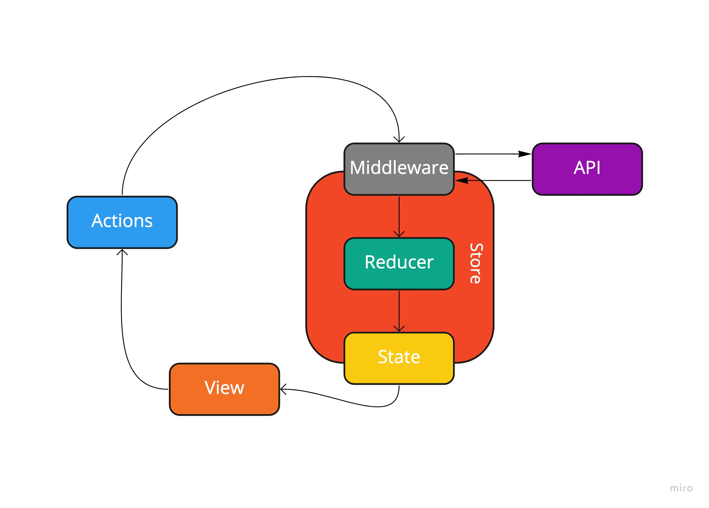

# Redux

Redux architecture is about strict, unidirectional data flow. All data in the application follows the same lifecycle, making the logic easier to understand and debug and eliminating the need to maintain multiple copies of data across the application.

* State: Current state of the app. Can be divided further into substates.
* View: A UI component that dispatches Actions to the Store.
* Action: Basic objects dispatched by the View in order to change State.
* Middleware: Optional layer used for API calls, logging, analytics, crash reports, etc.
* Reducer: Pure function that transforms Actions into State changes.
* Store: Aggregates State, Reducers and Middleware. Notifies View on State changes.

