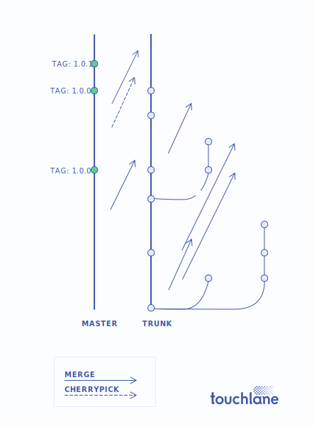

# Trunk Based Development

Source-control branching model, where developers collaborate on code in a single branch called *trunk*, resist any pressure to create other long-lived development branches by employing documented techniques. They therefore avoid merge hell, do not break the build, and live happily ever after.

## Release from master
No more release branches at all. Developers don't commit to *master* branch. Release happens with direct merge from *trunk* to *master* and cherry-picks for bug-fixes during beta-testing stage.

## Feature toggles
Trunk-based development usage introduces complexity because of many changes in code base in one branch. Feature toggles is a pattern which allows to enable/disable any functionality at specific environment and keep system configurable and stable. Devs keep feature ON locally until it ready for testing and then enable it on staging env. After passing testing stage every feature goes to *feature ready* status and wait for release time. Before merge to master, release manager marks required features as available in production. During beta testing any feature can be switched OFF again if necessary. This makes development process really flexible and allows to keep programm as independent, interchangeable modules, which contains everything necessary to execute only one aspect of the desired functionality.

:::note

The exact implementation of Feature toggles may vary across different projects and languages and is generally up to the development team.

:::